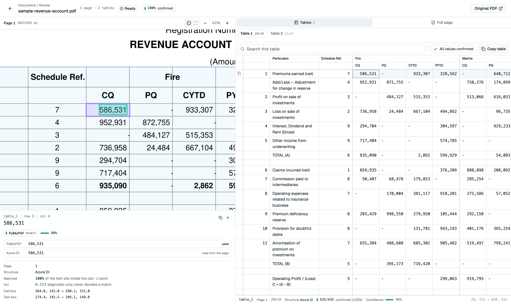
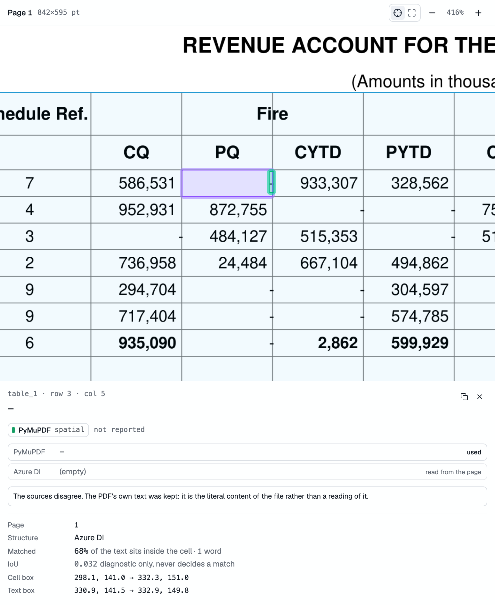
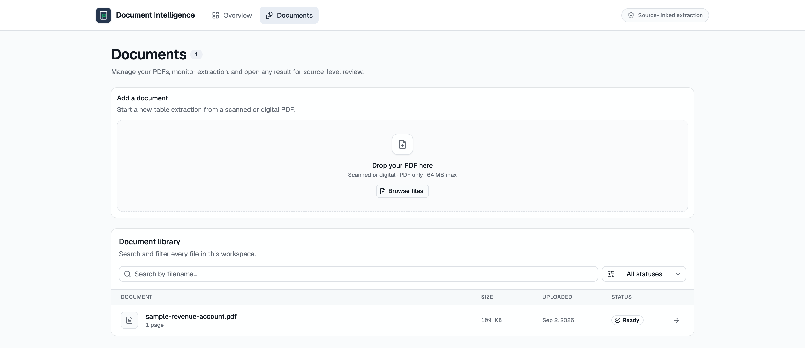

# Document Intelligence

Extract tables from any PDF, with every value traceable back to the page it came
from. Click a cell in the extracted table and see it highlighted in the original
— the exact characters, at the exact coordinates, with the source that produced
them.



Selecting a cell zooms the page to it and shows both readings side by side. The
cell below is a nil marker: a right-aligned dash straddling a column rule that
Azure DI returned nothing for. PyMuPDF has it, 68% of the glyph sits inside the
cell, and the PDF's own text is what the reviewer sees — with the disagreement
recorded rather than hidden.



The repository also still carries the filings-collection pipeline this started
as, on its own `filings` queue.

- **`src/api/`** — FastAPI service (Python 3.12, managed with `uv`)
- **`src/extraction/`** — PDF extraction: PyMuPDF + Azure DI, normalized
- **`src/db/`** — SQLAlchemy models, repositories, Alembic migrations
- **`src/storage/`** — blob storage for original PDFs (Cloudflare R2)
- **`src/jobs/`** — BullMQ queues and the worker that drains them
- **`web/`** — React SPA (Vite + TypeScript + TanStack Router/Query, shadcn/ui)
- **`compose.yml`** — Postgres for local development

## Getting started

With [`just`](https://just.systems):

```bash
just setup    # .env, dependencies, Postgres
just dev      # API on :8000, web on :5173, worker on every queue
just --list   # every recipe
```

The raw commands behind those recipes are below.

```bash
cp .env.example .env      # fill in Azure DI / R2 credentials
docker compose up -d      # Postgres
```

### API

```bash
uv sync
uv run fastapi dev src/api/main.py     # http://localhost:8000
```

Interactive docs at http://localhost:8000/docs.

| Endpoint | Description |
| --- | --- |
| `GET /health` | Liveness check |
| `GET /queues` | Queue names |
| `GET /queues/{queue}` | Job counts per state |
| `POST /queues/{queue}/jobs` | Enqueue a job |
| `POST /documents` | Upload a PDF; stores it and queues extraction (202) |
| `GET /documents` | List documents (paginated) |
| `GET /documents/{id}` | Status, metadata, and extraction summary |
| `GET /documents/{id}/pages` | Page geometry and counts — no page content |
| `GET /documents/{id}/pages/{n}` | One page in full; `?include=words` to trim |
| `GET /documents/{id}/pages/{n}/render` | Page as PNG; `?scale=2` (1.0 = 72 dpi) |
| `GET /documents/{id}/tables` | Table metadata — no cells |
| `GET /documents/{id}/tables/{tableId}` | One table with every cell |
| `GET /documents/{id}/tables/{tableId}/cells` | Cells, paginated |
| `GET /documents/{id}/file` | The original PDF |
| `POST /documents/{id}/extract` | Re-run extraction over the stored bytes |
| `DELETE /documents/{id}` | Remove the document, its extraction, and the blob |

Listings deliberately omit the heavy parts. A single filing page here carries
747 words and 714 cells, so page content and table cells are fetched only when
something is opened.

Add feature routers under `src/api/routers/` and register them in
`src/api/main.py`.

### Web

```bash
cd web
npm install
npm run dev              # http://localhost:5173
```

Vite proxies `/api/*` to `http://localhost:8000`, so no CORS setup is needed in
development. To point at a deployed API instead, set `VITE_API_URL`.

Other scripts: `npm run build` (typecheck + production build), `npm run lint`,
`npm run preview`.

## PDF extraction

Full design notes in **[docs/extraction.md](docs/extraction.md)**. The short
version:

**PyMuPDF owns deterministic PDF data** — metadata, page geometry, exact text
and its coordinates, images, links, annotations, fonts. **Azure Document
Intelligence owns document structure** — tables, rows, columns, cells, layout,
OCR, confidence. **The normalization layer connects them** by geometry alone:
no LLM, no fuzzy string matching, reproducible byte for byte.

```
src/extraction/
  geometry.py            bbox primitives: rotation, IoU, containment
  pymupdf_extractor.py   PdfExtractor — PDF data and page rendering
  azure_di.py            Azure client, retries, error mapping
  matcher.py             TableMatcher — word -> cell association
  normalizer.py          DocumentNormalizer — coordinates and provenance
  pipeline.py            ExtractionPipeline — orchestration, degradation
  types.py               the canonical schema
```

Every cell keeps **both** readings and records which one was used and why:

```json
{
  "row": 2, "column": 3,
  "text": "11,149",
  "azure_text": "11,149",
  "pymupdf_text": "11,149",
  "bbox": [265.27, 154.46, 296.28, 161.87],
  "confidence": 0.997,
  "text_source": {
    "source": "pymupdf", "matched": true, "method": "exact",
    "containment": 1.0, "iou": 0.537,
    "bbox": [277.08, 154.91, 295.52, 161.6], "word_count": 1
  }
}
```

Two rules are worth knowing before changing anything here.

**Coordinates.** Everything is in *page display space* — PDF points, top-left
origin, rotation already applied. PyMuPDF reports text in the unrotated
mediabox but renders rotated, so every box goes through `page.rotation_matrix`.
Azure reports polygons in inches, rescaled by the ratio of the two page sizes
rather than an assumed 72 dpi (on the sample document the factors are 72.058
and 72.024).

**Matching uses containment, never IoU.** A word belongs to a cell when ≥55% of
its area falls inside — above 50%, so the assignment is *exclusive* in a
non-overlapping grid. IoU measures cell padding, not match quality: 148 nil-marker
dashes sit perfectly inside 30pt-wide columns and score a median IoU of 0.03.
Grading on IoU discarded all of them in favour of Azure's empty string.

On the sample document: **all 570 populated cells (100%)** resolve against the PDF
text layer. Azure's `:selected:` / `:unselected:` checkbox markers are stripped
before a cell's value is chosen — they are state, not text, and the detector
fires on the empty boxes a ruled schedule is full of — so those cells read as
the blanks the document shows. The raw reading is kept on `azure_text`.

If Azure fails, the document is saved as `partial` — text, coordinates, and
metadata intact, tables missing, the error recorded — and
`POST /documents/{id}/extract` fills them in later. A PyMuPDF failure is fatal,
because there is no document without it.

## Database

SQLAlchemy 2.0 models with Alembic migrations. `documents` carries the
extraction record; `document_pages`, `document_tables`, and
`document_table_cells` carry the result.

```bash
just migrate                      # apply
just migration "add a column"     # autogenerate after editing db/models.py
just migrate-status
```

JSON columns use `JSON().with_variant(JSONB, "postgresql")`, so Postgres gets
real JSONB while the test suite runs the same models on SQLite.

`DATABASE_URL` stays in the plain `postgresql://` form that psycopg and BullMQ
want; `Settings.sqlalchemy_url` adds the `+psycopg` driver SQLAlchemy needs, so
the two never drift apart.

## Storage

Original PDFs go to Cloudflare R2 through the `DocumentStore` protocol
(`put`/`get`/`delete`/`exists`). Without R2 credentials the app falls back to an
in-memory store and logs a warning — enough to run and test locally, not enough
to deploy.

## Tests

```bash
just test          # pytest: 168 tests
just test-web      # vitest: 92 tests
just check         # both, plus lint and the production build
```

The Python suite needs no network and no Postgres: Azure is replayed from a
generated response (`tests/fixtures/sample-revenue-account.layout.json`),
storage is in-memory, and the database is SQLite through the production models.

The sample document is synthetic and generated, not a real filing — every name
and figure in it is invented. What is *not* invented is the geometry: it is a
landscape A4 page with two ruled tables, spanning column headers, 148
right-aligned nil dashes straddling a column rule, and two stray `:unselected:`
checkbox markers, because those are the properties the matcher exists to handle.
The layout JSON is derived from the same geometry that renders the PDF, so the
two genuinely agree.

Regenerate both halves with:

```bash
uv run python tests/fixtures/generate_sample.py
```

The output is deterministic, so a re-run is a no-op unless the generator
changed. Several tests pin measured counts (714 cells, 713 words, a 100% match
rate); changing the generator means re-running it and updating those numbers.

## Background jobs

Queues run on [BullMQ](https://docs.bullmq.io)'s PostgreSQL backend, so the same
Postgres instance carries both application data and the queue — no Redis. BullMQ
owns the `bullmq` schema (`QUEUE_SCHEMA`); it replaces the Redis key prefix, and
`opts["prefix"]` is rejected for that reason.

```bash
just worker              # every queue
just worker filings      # one queue
just queue-migrate       # apply the schema ahead of time (optional)
```

Migrations are applied lazily the first time a queue or worker touches the
database. They are idempotent and advisory-locked, so several processes can
start at once; `just queue-migrate` exists for deploys that would rather run
DDL as a separate step.

```
src/jobs/
  queues.py      queue names + connection options; get_queue() / close_queues()
  processors.py  PROCESSORS: queue -> job name -> async handler
  worker.py      entrypoint (python -m jobs.worker); drains on SIGTERM
  migrate.py     explicit schema migration
```

Two queues: `filings` for the collection pipeline, and `documents` for
`extract-document`, which runs the extraction pipeline over a stored PDF and
persists the canonical result.

To add work: name the queue in `queues.py`, write an `async def handler(job)` in
`processors.py`, and register it under that queue in `PROCESSORS`. Producers
enqueue with `await get_queue(FILINGS).add("parse-filing", {...})`, or over HTTP:

```bash
curl -X POST localhost:8000/queues/filings/jobs \
  -H 'content-type: application/json' \
  -d '{"name": "parse-filing", "data": {"source_url": "s3://…/filing.pdf"}}'
```

A handler that raises is retried per the job's `attempts`/`backoff` options;
raising `UnrecoverableError` fails it outright, which is what an unknown job
name does. Throughput is roughly 1.5–2× lower than the Redis backend — the cost
of durable transactional writes — which is well within budget for this pipeline.

## Frontend layout




```
web/src/
  routes/                    file-based routes; routeTree.gen.ts is generated
    __root.tsx               shell + devtools, typed router context
    index.tsx                home
    index.tsx                landing: what it does, and upload
    documents.index.tsx      document list
    documents.$documentId.tsx  the viewer
  components/extraction/
    DocumentViewer.tsx       the page/table split, and the mobile tabs
    PdfPageViewer.tsx        rendered page, follow-the-selection zoom
    pdfZoom.ts               zoom + centring arithmetic (tested)
    BoundingBoxOverlay.tsx   highlight boxes, positioned as page fractions
    ResizableSplit.tsx       draggable divider, ratio persisted
    UploadDropzone.tsx       shared by the landing and the list
    TableList.tsx            table selector
    TableViewer.tsx          the grid
    TableToolbar.tsx         search, the review queue, copy
    TableMetadata.tsx        the status line under a table
    CellDetails.tsx          the per-cell audit trail
    ExtractionSourceBadge.tsx  where a value came from
    ConfidenceIndicator.tsx  confidence, quietly
    tableGrid.ts             spans, groups, search, sort, TSV export
  components/ui/             shadcn primitives
  hooks/                     useElementSize, useMediaQuery
  theme.css                  the palette and type — NOT owned by the CLI
  lib/
    types.ts                 wire types mirroring the canonical schema
    api.ts                   typed client
    queries.ts               TanStack Query option factories
  index.css                  Tailwind + shadcn theme tokens — owned by the CLI
```

### The viewer

`/` uploads a PDF; `/documents/{id}` opens it with the rendered page on one side
and the extracted table on the other, split by a divider you can drag (the ratio
persists). Selecting a table frames its region on the page; selecting a cell
draws two boxes — the cell as Azure bounded it, and the exact PyMuPDF words
inside it — and the inspector below shows what each source read, which won, and
the geometry behind that decision.

**The page pane follows your selection.** This is the design decision the viewer
turns on. A landscape page fitted to half a screen renders at **0.91 CSS px per
point** — below 72 dpi, where a 7pt figure is about six pixels tall and cannot
be read. A viewer that defaults to the whole page therefore fails at its only
job. So selecting a cell zooms to it, with its neighbours still in view, at
roughly **3.6×** — where the digits are legible. `Whole page` stays one click
away. The maths lives in `pdfZoom.ts` and is unit-tested.

Page images are rendered server-side by the same PyMuPDF page object that
produced the stored coordinates, so overlays need no calibration and rotated
pages need no client-side handling. Overlays are positioned as a **fraction of
the page box** rather than by multiplying by the render scale: PyMuPDF rounds
pixmaps up to whole pixels (841.68pt at scale 2 is 1684px, not 1683.36), so a
scale multiply drifts at the right and bottom edges.

### Reading a table

Columns are banded by the groups Azure found in the header spans, so a 19-column
sheet reads as its real blocks rather than one wall of figures. Figures are set
in a tabular mono face so a wrong digit is visible down a column. Only the
*exceptions* are marked: a corner flag for a value Azure read but the PDF text
layer could not confirm, or for low OCR confidence — decorating all 539 cells
would hide the two that matter. The toolbar counts those cells and steps through
them, which is the actual review workflow.

The grid scrolls as one piece: no frozen header row, no pinned column.

The router context carries a shared `QueryClient`, so route loaders can prefetch
with `ensureQueryData` and components read the result back with
`useSuspenseQuery`.

Styling is Tailwind v4 utilities plus shadcn's theme tokens (`bg-card`,
`text-muted-foreground`, …). Add components with
`npx shadcn@latest add <name>`; they land in `src/components/ui/`.

`shadcn` commands rewrite `index.css`, so the palette lives in `theme.css`,
imported after it in `main.tsx`. Dark mode follows the OS setting via the inline
script in `index.html`, which toggles the `.dark` class shadcn themes off.

**Colour is data.** The neutrals are a cool blue-grey; the only chromatic values
in the interface are provenance, and each means exactly one thing:

| token | meaning |
| --- | --- |
| `--confirmed` (emerald) | confirmed against the PDF's own text layer |
| `--reported` (amber) | Azure's reading, unconfirmed |
| `--selected` (violet) | your current selection |

Nothing else is allowed to be coloured, so a coloured pixel anywhere on screen
is a claim about where a value came from.
